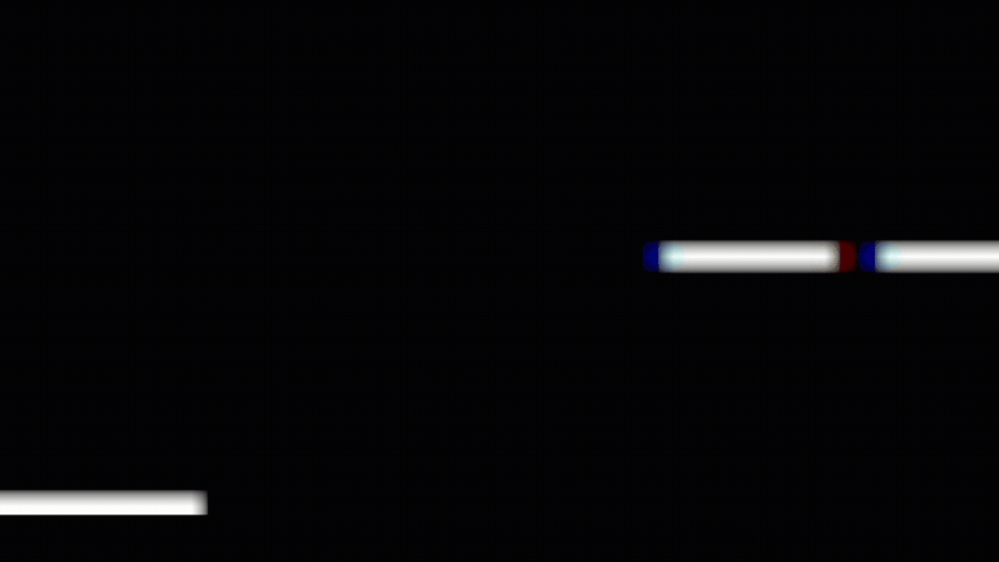

# 🌟  **Ghid animații în C++**  🌟

În acest ghid, îți voi explica pas cu pas cum funcționează animația din codul `Startup_Code.cpp`.
<br> <br>


## ✅ **Pasul 0: Testarea Codului**

Copiază codul din `Startup_Code.cpp` și rulează-l aici:  
👉 [Compilator Online C++](https://www.onlinegdb.com/online_c++_compiler)

🔍 Vezi cum liniile se mișcă una câte una. Magie simplă! ✨


# 🧠 **Pasul 1: Înțelegerea Codului**

### 🔸 Ce face acest cod?

Creează o **animație simplă** în linie, unde un „-” se plimbă de la stânga la dreapta și înapoi.  
E ca o bară de încărcare în slow-motion.

* * *

### 🔹 `clear_terminal()`

```cpp
void clear_terminal() {
    #ifdef _WIN32
        system("cls");
    #else
        system("clear");
    #endif
}
```

🧼 Curăță tot ce e pe ecran.  
Fără ea, animația ar apărea pe linii noi una sub alta și ar arăta urât.  
Funcționează atât pe Windows, cât și pe Linux/Mac.

* * *

### 🔹 `sleep_ms(int milliseconds)`

```cpp
void sleep_ms(int milliseconds) {
    this_thread::sleep_for(chrono::milliseconds(milliseconds));
}
```

⏳ Pune o pauză între cadre.  
Așteaptă cât îi zici tu (în milisecunde).  
În cod, e folosit cu `50`, adică o așteptare de 0.05 secunde.

* * *

### 🔹 `loop()`

```cpp
void loop() {
    cout << "-    " << endl;
    sleep_ms(50);
    clear_terminal();

    cout << "--   " << endl;
    sleep_ms(50);
    clear_terminal();

    cout << " --  " << endl;
    sleep_ms(50);
    clear_terminal();

    cout << "  -- " << endl;
    sleep_ms(50);
    clear_terminal();

    cout << "   --" << endl;
    sleep_ms(50);
    clear_terminal();

    cout << "    -" << endl;
    sleep_ms(50);
    clear_terminal();
}
```

🔁 Desenează fiecare **cadru** al animației:

* `"- "` → `"-- "` → `" -- "` → ... → `" -"`
    

Fiecare linie e afișată, apoi se face pauză, apoi se curăță ecranul.  
Așa pare că simbolul „-” **se mișcă** spre dreapta.

* * *

### 🔹 `main()`

```cpp
int main() {
    while (true) {
        loop();
    }
    return 0;
}
```

🔄 Rulează `loop()` **la nesfârșit**.  
Animația se repetă mereu, ca un GIF care nu se oprește.

## 🎬 **Pasul 2: Rulează alte animații!**

Acum că știi cum funcționează codul de bază, e timpul să încerci ceva mai avansat!

### 🔸 1. `Hot_Air_Baloo.cpp` 🎈

Animație cu un balon cu aer cald care se ridică.

👣 Ce trebuie să faci:

* Deschide fișierul `Hot_Air_Baloo.cpp`
    
* Rulează-l în același compilator online
    
* Observă cum se mișcă balonul pas cu pas!
    

* * *

### 🔸 2. `Stickman.cpp` 🕴️

Animație cu un omuleț care merge.

👣 Pași:

* Deschide fișierul `Stickman.cpp`
    
* Rulează-l!
    
* Omulețul se animă în pași simpli, ca o caricatură în mișcare.
    
## ✏️ **Pasul 3: Creează-ți propria animație!**

Acum e rândul tău! 🎉

### 🔹 Ce ai de făcut:

1. Creează mai multe **cadre** folosind `cout`
    
2. Între ele, folosește:
    
    * `sleep_ms(...)` pentru pauză
        
    * `clear_terminal()` pentru curățare
        
3. Pune-le într-o funcție `loop()` care se repetă
    

### 🔸 Exemplu simplu:

```cpp
void frame1()
{
    cout<<"/";
    cout<<"\n";
}

void frame2()
{
    cout<<"|";
    cout<<"\n";
}

void frame3()
{
    // "\" in plus este adaugata pentru a putea afisa backslash
    cout<<"\\";
    cout<<"\n";
}

void my_animation() {
    frame1();
    sleep_ms(200);
    clear_terminal();

    frame2();
    sleep_ms(200);
    clear_terminal();

    frame3();
    sleep_ms(200);
    clear_terminal();

    frame2();
    sleep_ms(200);
    clear_terminal();
}
```

### 🔁 Apoi în `main()`:

```cpp
while (true) {
    my_animation();
}
```
